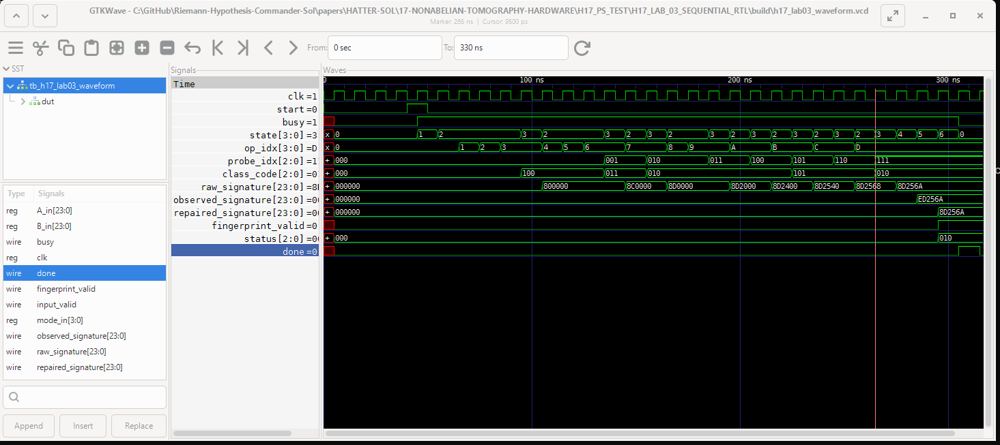

# HATTER-SOL-17
# От неабелевой томографии к математическому процессору, FPGA и физическому кремнию

**Автор публикации:** Malachevsky, A.A.  
**ORCID:** 0009-0008-6009-3196  
**AI research collaborator / соавтор исследовательского диалога:** Commander Sol / Hatter Sol  
**Статус:** publication candidate · manifesto + reproducible laboratory  
**Версия:** RU v1.1 · 19 September 2026  
**DOI HATTER-SOL-17:** 10.5281/zenodo.22832502

---

## Аннотация

Эта работа исследует путь от конечной неабелевой томографии к аппаратной реализации.

В лаборатории

\[
G=PSL(2,7)
\]

рассматриваются generating ordered pairs \((A,B)\), факторизованные по simultaneous conjugation. Полное пространство содержит

\[
19152
\]

generating pairs и распадается на

\[
114
\]

simultaneous-conjugacy orbits.

Мы строим короткие семейства group-word observations, которые разделяют эти орбиты, доказываем минимальные глубины и минимальное число наблюдений для one-known-erasure reconstruction, строим exact structural classifier, ROM-free repair network и оптимальный shared word DAG, а затем переносим конструкцию в RTL.

Главная инженерная идея работы состоит не в том, чтобы объявить H17 готовым универсальным ECC или готовым промышленным контроллером, а в том, чтобы показать воспроизводимый путь:

\[
\boxed{
\text{symmetry theorem}
\rightarrow
\text{orbit tomography}
\rightarrow
\text{Boolean architecture}
\rightarrow
\text{RTL}
\rightarrow
\text{target hardware experiment}
}
\]

Работа также формулирует границы текущей fault model и выделяет направления следующего поколения: adaptive word tomography, Nielsen dynamics, hardware root-of-trust/PUF, symmetry compression for GNN and quantum decoding, streaming non-Abelian automata and attack-first non-Abelian cryptography.

Версия v1.1 включает новый аппаратный слой **H17-LAB-03**: последовательную time-multiplexed архитектуру с одним переиспользуемым class engine. Она проходит все 29 911 frozen golden vectors, имеет измеренную RTL transaction latency 26 циклов и снабжена публикационной VCD/GTKWave осциллограммой.

---

## 1. Почему H17

Обычный аппаратный алгоритм часто начинается с логической функции и заканчивается измерением LUT, FF и Fmax.

H17 идёт в обратную сторону.

Сначала строится математическая задача:

> какие короткие наблюдения конечного неабелева объекта достаточно различают его состояния modulo symmetry?

Затем исследуется, какую аппаратную цену имеет найденная theorem layer.

Так появляется возможность измерить не только стоимость схемы, но и **стоимость математического утверждения**.

В H17 это особенно видно на closure-aware architecture: групповая замкнутость позволяет удалить повторяющиеся membership tests для derived words и почти вдвое сократить generic synthesized frontend logic.

---

## 2. Конечная лаборатория

Используется группа

\[
G=PSL(2,7),
\qquad |G|=168.
\]

Рассматриваются ordered pairs:

\[
(A,B)\in G^2
\]

такие, что

\[
\langle A,B\rangle=G.
\]

Всего таких generating pairs:

\[
\boxed{19152}.
\]

На них действует simultaneous conjugation:

\[
(A,B)\mapsto
(hAh^{-1},hBh^{-1}),
\qquad h\in G.
\]

Получается:

\[
\boxed{114}
\]

generating simultaneous-conjugacy orbits.

Каждая такая орбита имеет размер:

\[
\boxed{168}.
\]

Следовательно:

\[
114\cdot168=19152.
\]

Идентификаторы орбит фиксируются как:

\[
0,1,\ldots,113.
\]

---

## 3. Наблюдения как group words

Пусть:

\[
a=A^{-1},
\qquad
b=B^{-1}.
\]

Для group word \(w\) рассматривается conjugacy class:

\[
c_w(A,B)=\operatorname{class}(w(A,B)).
\]

Для \(PSL(2,7)\) используются oriented classes:

\[
1A,\ 2A,\ 3A,\ 4A,\ 7A,\ 7B.
\]

Именно порядок букв важен:

\[
AB\neq BA.
\]

Поэтому group word является не просто строкой, а программой наблюдения неабелевой структуры.

---

## 4. От пяти probes к robust8

Родительская H16-конструкция показала, что пять probes:

\[
A,\ B,\ AB,\ Ab,\ ABab
\]

разделяют все 114 generating orbits.

Но injectivity ещё не означает erasure robustness.

H17 ставит более сильную задачу:

> найти минимальное семейство probes, которое различает generating orbits и сохраняет однозначность после потери одной известной coordinate.

Для полного primitive cyclic trace family глубины до 5 решается конечная covering problem.

Получено:

\[
\boxed{
\text{minimum joint one-known-erasure probe count}=8.
}
\]

Одна оптимальная семья:

\[
\boxed{
AAB,\;
Abb,\;
AAAB,\;
Abbb,\;
AABAb,\;
AAbAb,\;
ABABB,\;
ABaBB
}
\]

с:

\[
d_{\mathrm{gen/gen}}=2,
\qquad
d_{\mathrm{gen/non}}=2.
\]

Это означает, что удаление любой одной известной coordinate не разрушает идентификацию generating orbit и separation from non-generating states.

---

## 5. Минимальная глубина

Полная primitive family глубины до 4 имеет 25 coordinates, но:

\[
d_{\min}=1.
\]

Существуют ровно семь пар generating orbits, различимых только одним probe в depth-\(\le4\) family.

Для всех семи дефектов необходимым separator оказывается commutator:

\[
ABab=[A,B].
\]

Exact-depth-5 probe:

\[
AABAb
\]

разделяет все семь defect pairs.

Следовательно:

\[
\boxed{
\text{minimum possible maximum primitive depth}=5.
}
\]

Это первый важный пример того, что аппаратная глубина наблюдения ограничивается не эвристикой, а theorem layer.

---

## 6. Structural classifier без orbit ROM

Входной group element представлен 24-битной перестановкой восьми точек.

Structural classifier проверяет:

1. bijectivity;
2. projective cross-ratio consistency;
3. PSL orientation;
4. conjugacy class.

Exhaustive enumeration всех

\[
8!=40320
\]

перестановок даёт:

\[
PGL(2,7)=336,
\qquad
PSL(2,7)=168.
\]

Для valid PSL members классы orders \(1,2,3,4\) соответствуют:

\[
1A,2A,3A,4A,
\]

а order-7 elements разделяются на:

\[
7A,\ 7B
\]

по orientation test.

---

## 7. ROM-free repair

24-битный robust8 fingerprint:

\[
F(A,B)=(c_0,\ldots,c_7)
\]

сам является canonical generating-orbit fingerprint.

Для каждого известного erased coordinate exact dynamic programming строит minimum worst-case repair decision tree depth:

\[
\boxed{4}.
\]

Количество internal nodes по восьми erasure modes:

\[
41,\ 41,\ 43,\ 43,\ 30,\ 39,\ 39,\ 30.
\]

Итого:

\[
306
\]

nodes до synthesis/factoring.

Это позволяет восстанавливать erased class coordinate без 114-entry orbit decoder ROM.

---

## 8. Shared word DAG

Если восемь robust words вычислять независимо, требуется:

\[
26
\]

permutation compositions.

Exact DAG optimization снижает это до:

\[
\boxed{14}
\]

при максимальной composition depth:

\[
\boxed{3}.
\]

Один optimum:

\[
\text{level 1: } AB,\ Ab,\ BB;
\]

\[
\text{level 2: } AAB,\ ABA,\ ABa,\ Abb,\ AbAb;
\]

\[
\text{level 3: } AAAB,\ Abbb,\ AABAb,\ AAbAb,\ ABABB,\ ABaBB.
\]

Это проверено на всех:

\[
168^2=28224
\]

ordered PSL pairs.

---

## 9. Closure-aware theorem как аппаратная оптимизация

Ключевой групповой факт:

\[
A,B\in PSL(2,7)
\Rightarrow
w(A,B)\in PSL(2,7)
\]

для любого free-group word \(w\).

Следовательно, derived words не требуют повторной полной membership проверки.

Архитектура:

\[
2\times\text{membership-only}(A,B)
+
8\times\text{member-class-only}.
\]

При одинаковой generic Yosys methodology получено:

| Design | Full classifier | Closure-aware | Reduction |
|---|---:|---:|---:|
| robust8 frontend | 38957 | 20485 | 47.42% |
| flat orbit-ID core | 43330 | 24730 | 42.93% |
| ROM-free fingerprint core | 42484 | 23937 | 43.66% |

Это **generic Boolean-cell counts**, а не LUT/FF/Fmax конкретного FPGA.

Главный смысл таблицы:

\[
\boxed{
\text{теорема о замкнутости удаляет аппаратную логику.}
}
\]

---

## 10. Три RTL-лаборатории: от таблиц к последовательному процессору

Практическая часть H17 теперь имеет три различных архитектурных уровня.

### 10.1. LAB-01 — sequential table-driven reference

LAB-01 намеренно медленный и прозрачный. Он использует таблицы конечной модели и служит golden reference:

[
(A,B)

ightarrow
	ext{table-driven classification}

ightarrow
	ext{orbit/fingerprint result}.
]

Его задача — не минимизировать аппаратную стоимость, а зафиксировать воспроизводимый внешний контракт.

### 10.2. LAB-02 — fully combinational closure-aware processor

LAB-02 переносит H17-06/H17-07/H17-08 непосредственно в комбинационную RTL-сеть:

[
(A,B)

ightarrow
14	ext{-composition DAG}

ightarrow
8	ext{ class engines}

ightarrow
	ext{ROM-free repair}.
]

Эта архитектура синтезируема и полезна как technology-independent Boolean object. Однако в Icarus она создаёт чрезвычайно тяжёлый zero-delay event graph. На втором независимом Windows 10 host один smoke-vector накопил около

[
17841
]

CPU seconds без завершения.

Это не означает, что «один аппаратный такт длится часы». В LAB-02 внутреннего clock вообще нет. Testbench меняет входы и ждёт `#1`; прежде чем simulation time продвинется на 1 ns, event-driven simulator обязан стабилизировать всю комбинационную сеть.

### 10.3. LAB-03 — sequential / time-multiplexed processor

LAB-03 меняет только архитектуру исполнения, не математику:

[
oxed{
	ext{пространство}

ightarrow
	ext{время}.
}
]

Архитектура:

[
egin{aligned}
&A,B 	ext{latch}\
&downarrow\
&2	imes	ext{raw membership checks}\
&downarrow\
&14 	ext{shared DAG compositions, one per cycle}\
&downarrow\
&1	imes	ext{reused member-class-only engine}\
&downarrow\
&8	imes3	ext{-bit fingerprint registers}\
&downarrow\
&	ext{known erasure mask}\
&downarrow\
&	ext{ROM-free repair}\
&downarrow\
&	ext{done}.
end{aligned}
]

Таким образом, восемь class observations вычисляются не восемью параллельными classifier-блоками, а одним classifier, который используется восемь раз по времени.

---

## 11. LAB-03: воспроизводимый RTL-результат

### 11.1. Smoke

На независимом Windows 10 host один representative vector завершился за

[
oxed{0.081 	ext{s wall-clock}}.
]

Этот результат не сравнивается как FPGA speedup с незавершённым LAB-02 run; он показывает только, что архитектурная сериализация устранила практический барьер Icarus simulation.

### 11.2. Quick regression

Полный quick-набор:

[
oxed{1796/1796 	ext{PASS}}
]

при

[
oxed{max_wait_cycles=26}
]

и wall-clock:

[
oxed{4.682 	ext{s}}.
]

### 11.3. Full regression

Полный frozen corpus LAB-01/LAB-03:

[
oxed{29911/29911 	ext{PASS}}
]

при том же

[
oxed{max_wait_cycles=26}
]

и wall-clock:

[
oxed{91.984 	ext{s}}.
]

Для каждого вектора testbench сравнивает:

- `status`;
- `raw_signature`;
- `observed_signature`;
- `repaired_signature`;
- `fingerprint_valid`.

Следовательно, на опубликованном finite golden-vector domain последовательная архитектура сохраняет внешний математический контракт LAB-01.

Важно: 26 cycles — **RTL transaction latency этой FSM**, а не физическая задержка конкретного FPGA. Для target clock (f_{
m clk}) физическая latency была бы

[
T_{
m transaction}=rac{26}{f_{
m clk}},
]

но допустимый (f_{
m clk}) определяется только после target synthesis/place-and-route.

---

## 12. Публикационная waveform: как математика видна во времени

Для waveform выбран canonical generating vector:

[
A=	exttt{5E3B88},
qquad
B=	exttt{7ECC11},
qquad
mode=1.
]

Golden contract:

[
	exttt{raw}=	exttt{8D256A},
]

[
	exttt{observed}=	exttt{ED256A},
]

[
	exttt{repaired}=	exttt{8D256A},
qquad
status=2.
]

**Рисунок 1. H17-LAB-03: последовательное построение и восстановление robust8-сигнатуры.** Для входной пары (A=	exttt{5E3B88}), (B=	exttt{7ECC11}) процессор выполняет общий 14-композиционный word DAG, последовательно классифицирует восемь probes одним переиспользуемым class engine и за 26 тактов формирует fingerprint (	exttt{8D256A}). В режиме `mode=1` первая трёхбитная координата заменяется маркером стирания `111`, вследствие чего наблюдаемая сигнатура становится (	exttt{ED256A}). ROM-free repair network восстанавливает исходный fingerprint (	exttt{8D256A}), после чего устанавливаются `fingerprint_valid=1`, `status=2` и импульс `done`. Показанные времена относятся к RTL simulation clock и не являются измерением частоты или физической задержки FPGA.

### 12.1. Чтение waveform

Сигналы `state`, `op_idx` и `probe_idx` показывают внутренний ход FSM.

`state=2` соответствует очередной permutation composition; `state=3` — классификации очередного probe. `op_idx` проходит 14 узлов frozen H17-07 DAG, а `probe_idx` отмечает восемь наблюдаемых слов.

По мере появления class codes `raw_signature` ступенчато собирается и достигает

[
	exttt{8D256A}.
]

При `state=4` выполняется mask. Mode 1 заменяет coordinate 0 на

[
111,
]

поэтому:

[
oxed{
	exttt{8D256A}

ightarrow
	exttt{ED256A}.
}
]

При `state=5` ROM-free decision tree восстанавливает потерянную class coordinate:

[
oxed{
	exttt{ED256A}

ightarrow
	exttt{8D256A}.
}
]

После этого:

[
fingerprint_valid=1,qquad status=2,
]

и `done` завершает транзакцию.

Таким образом, waveform визуально показывает всю цепочку:

[
oxed{
	ext{group words}

ightarrow
	ext{classes}

ightarrow
	ext{fingerprint}

ightarrow
	ext{erasure}

ightarrow
	ext{exact repair}.
}
]

---

## 13. Что именно восстанавливает H17

Это принципиальная граница.

Текущий robust8 repair восстанавливает:

\[
\boxed{
\text{one known fingerprint-coordinate erasure}
}
\]

то есть:

\[
(c_0,\ldots,c_{j-1},?,c_{j+1},\ldots,c_7)
\Rightarrow
(c_0,\ldots,c_7).
\]

Он **не восстанавливает**:

- потерянный \(A\);
- потерянный \(B\);
- произвольный внешний sensor;
- неизвестно где повреждённую coordinate;
- общий FPGA fabric failure.

В LAB-02 erasure пока вводится после вычисления полного fingerprint.

Поэтому это строгая RTL-демонстрация mathematics, но ещё не physical channel failure.

---

## 14. Путь к физическому эксперименту

Следующий hardware step должен заменить искусственный mask на восемь independent valid/data paths:

\[
(A,B)
\rightarrow
\begin{cases}
P_0\\
P_1\\
\vdots\\
P_7
\end{cases}
\rightarrow
\text{repair}.
\]

Каждый \(P_i\) должен быть отдельным logical/physical probe channel.

Тогда известная потеря:

\[
P_j=\mathrm{ERASED}
\]

становится реальным fault model.

Это создаёт естественный мост к:

- distributed probe fabric;
- structural BIST;
- fault localization;
- degraded mode;
- region-separated FPGA experiment.

---

## 15. Почему FPGA выбирается после логики

H17 сознательно не привязывает architecture к конкретной плате до получения требований.

Сначала измеряются:

- LUT/FF class;
- need for BRAM;
- routing complexity;
- timing;
- clocking;
- floorplanning requirements;
- physical separation requirements;
- possible PUF primitives;
- instrumentation needs.

Только после этого выбирается FPGA family/board.

Это делает выбор железа следствием архитектуры, а не наоборот.

---

## 16. От статической к адаптивной томографии

Фиксированная observer family — не единственный вариант.

Можно выбирать следующее group word в зависимости от уже полученных classes:

\[
c_1
\rightarrow
w_2(c_1)
\rightarrow
c_2
\rightarrow
w_3(c_1,c_2)
\rightarrow\cdots
\]

Так возникает:

\[
\boxed{\text{adaptive non-Abelian tomography}}.
\]

Это направление вынесено в HATTER-SOL-18.

Главная идея:

> group words становятся не фиксированным списком probes, а branching program, который адаптируется к наблюдаемому объекту.

---

## 17. Nielsen dynamics

Другой путь — менять сами generators:

\[
(A,B)\mapsto(B,A),
\]

\[
(A,B)\mapsto(A^{-1},B),
\]

\[
(A,B)\mapsto(AB,B).
\]

Тогда 114 orbit states становятся вершинами dynamic state graph.

Это превращает H17 из статической tomography в:

\[
\boxed{\text{non-Abelian dynamical tomography}}.
\]

В H18 этот слой будет исследоваться совместно с adaptive word selection.

---

## 18. Application models, not claims

H17 не объявляет готовыми следующие приложения. Он формулирует проверяемые research programs.

### 18.1. Equivariant AI / GNN

Идея:

\[
\text{local graphlet}
\rightarrow
\text{orbit signature}
\rightarrow
\text{reuse/canonicalization}.
\]

Перед hardware требуется сравнить expressive power с WL hierarchy на конечных graphlet families.

### 18.2. Robotics / aerospace

Идея:

\[
SO(3),SE(3)
\rightarrow
\text{finite orbit/grid automaton}.
\]

Цель — bounded-error discrete attitude tracking, а не обещание zero physical drift.

### 18.3. Quantum syndrome decoding

Идея:

\[
\text{syndrome}
\rightarrow
\text{symmetry orbit}
\rightarrow
\text{compressed decoder state}.
\]

Surface-code symmetry и braid-group models должны исследоваться отдельно.

### 18.4. Streaming network telemetry

Идея:

\[
\text{packet-event stream}
\rightarrow
\text{non-Abelian state update}
\rightarrow
\text{structural anomaly signature}.
\]

Это потенциально line-rate friendly, но реальные throughput claims требуют target pipeline.

### 18.5. Hardware Root-of-Trust / PUF

Идея:

\[
\text{physical silicon}
\rightarrow
\text{stable PUF features}
\rightarrow
(A,B)
\rightarrow
\text{H17 structural attestation}.
\]

H17 здесь рассматривается как tamper/anomaly structure, а не как замена стандартной cryptography.

### 18.6. Non-Abelian / post-quantum research seed

Идея hidden conjugator:

\[
A'=hAh^{-1},
\qquad
B'=hBh^{-1}.
\]

Информационная потеря quotient map:

\[
\neq
\]

computational hardness.

Поэтому это только attack-first research direction.

---

## 19. Универсальный pipeline будущих применений

Для каждого нового domain:

\[
\boxed{
\text{DOMAIN MODEL}
\rightarrow
\text{SYMMETRY THEOREM}
\rightarrow
\text{SEPARATING PROBES}
\rightarrow
\text{EXHAUSTIVE/SOFTWARE TEST}
\rightarrow
\text{RTL}
\rightarrow
\text{TARGET SYNTHESIS}
\rightarrow
\text{PHYSICAL BENCHMARK}
}
\]

Если отсутствует meaningful map:

\[
\Phi:X\rightarrow \mathcal S,
\]

то H17 превращается лишь в необычный encoder.

Если \(\Phi\) отражает естественную symmetry предметной области, orbit processor приобретает самостоятельный смысл.

---

## 20. Уровни доказательности

В H17 вводится явная маркировка:

- **THEOREM** — доказано математически;
- **EXHAUSTIVE COMPUTATION** — проверено полным finite enumeration;
- **RTL VERIFIED** — проверено simulation;
- **GENERIC SYNTHESIS** — technology-independent synthesis;
- **TARGET SYNTHESIS** — mapped to a concrete FPGA;
- **MEASURED HARDWARE** — измерено на physical board;
- **RESEARCH HYPOTHESIS** — ещё не доказанное направление.

Это позволяет не смешивать математические результаты, RTL и future applications.

---

## 21. Итог

H17 показывает конечный пример того, как symmetry quotient можно превратить в exact hardware object.

Получена цепочка:

\[
\boxed{
PSL(2,7)
\rightarrow
114\ \text{orbits}
\rightarrow
8\ \text{robust probes}
\rightarrow
14\ \text{shared compositions}
\rightarrow
\text{closure-aware classifier}
\rightarrow
\text{ROM-free repair}
}
\]

Смысл результата не в утверждении, что найден универсальный fault-tolerant processor.

Смысл в другом:

> математическая структура может определять не только правильность алгоритма, но и архитектуру аппаратуры, её redundancy, её минимальную глубину и даже то, какую логику можно удалить.

Следующий инженерный шаг H17 — generic synthesis LAB-03 и затем target-specific mapping. LAB-03 уже закрыл full RTL equivalence gate на 29 911 frozen vectors и дал публикационную waveform.

Следующий математический шаг серии — HATTER-SOL-18:

\[
\boxed{
\text{Adaptive Word Tomography and Nielsen Dynamics}
}
\]

где фиксированное множество probes заменяется программой наблюдений, которая сама зависит от уже полученной structural information.
